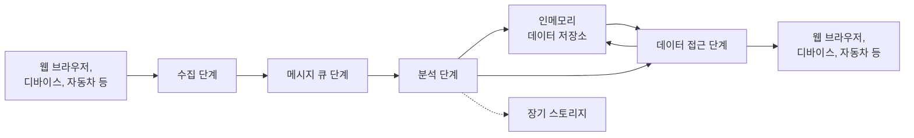
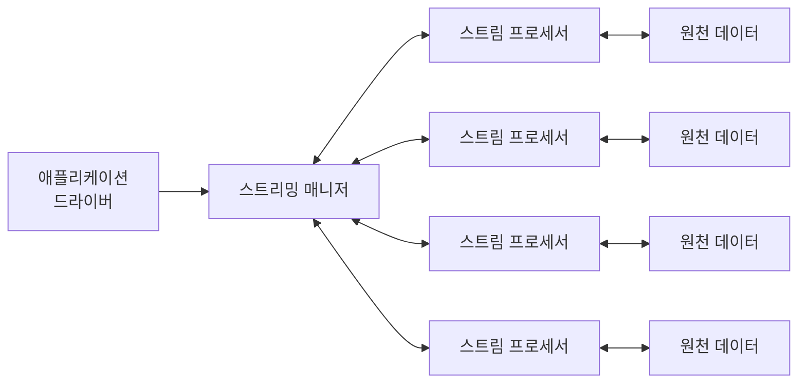

# 스트리밍 아키텍처 정리

## 개요
실시간 데이터 파이프라인 아키텍처라는 책을 읽고 관련 내용을 정리하고 실습하는 프로젝트 입니다.  

## 개념 정리

**실시간 시스템(Real-time systems)**은 애플리케이션이 필요한 시점에 데이터를 요청하고 응답받는 방식으로 데이터를 처리하는 시스템이다. 데이터가 발생한 즉시 전달되지 않더라도, 수 초 정도의 지연을 허용하면서 요청/응답 패턴을 통해 데이터를 조회할 수 있다.  

**스트리밍 시스템(Streaming systems)**은 웹소켓(WebSocket), SSE(Server-Sent Events)와 같이 클라이언트와 서버 간 연결을 지속적으로 유지하는 통신 패턴을 사용한다. 수집된 데이터는 메시지 큐, 데이터 처리 및 분석, 인메모리 저장소 등의 과정을 거쳐 실시간으로 전달되거나 조회할 수 있도록 구성된다.  

분석 단계는 일반적으로 단일 서버에서 수행하지 않고, 여러 서버로 작업을 분산하는 분산 스트림 프로세싱 아키텍처로 구성한다. 대표적인 기술로는 Apache Spark, Apache Storm, Apache Flink, Samza 등이 있다.  
이러한 기술들은 구현 방식에 차이가 있지만, 일반적인 스트리밍 분석 아키텍처는 서로 유사한 구조로 구성된다. 대표적인 구조는 다음과 같다.  

### 분산 스트림 프로세싱 아키텍처 구성요소

- 애플리케이션 드라이버 : 일부 스트리밍 시스템에서는 스트리밍 코드를 작성하거나 스트리밍 매니저와 통신하기 위해 애플리케이션 드라이버를 작성해야 할 수도 있다. 스파크 스트리밍에서 드라이버는 스트리밍 매니저에 잡을 등록하고 마지막에 결과를 수집하여 잡의 생명주기를 관리하는 데 사용된다.
- 스트리밍 매니저 : 스트리밍 잡을 스트림 프로세서들로 보내는 역할을 한다. 때때로 스트림 프로세서가 필요로 하는 리소스를 제어하거나 요청할 수 있다.
- 스트림 프로세서 : 여기가 바로 진정한 프로세싱이 일어나는 곳이다. 스트리밍 플랫폼에 따라 동작하는 방식이 다르지만 잡(Job)이 제출되는 동시에 실행된다.
- 원천 데이터 : 스트리밍 잡을 실행하는 데 필요한 데이터의 입력 또는 출력을 뜻한다. 일부 플랫폼에서는 단일 잡이 다수의 원천 데이터를 가져올 수도 있지만, 일반적으로 단일 원천 데이터만 가져올 수 있다. 또한 프로세싱이 완료된 결과 데이터를 드라이버가 수집할 수도 있고, 다른 시스템이 가져가거나 다른 잡의 입력으로도 활용할 수 있도록 저장할 수도 있다.

### 분석 단계
분석 단계에서는 윈도우(Window) 개념이 중요하다. 스트림 데이터는 지속적으로 유입되기 때문에 모든 데이터를 메모리에 보관하면서 처리할 수 없으므로, 일정한 범위의 데이터만 윈도우로 묶어 처리한다.

윈도우(Window)란 스트림 데이터 중 계산 및 분석의 대상이 되는 일정 범위의 데이터를 말한다. 윈도우에는 트리거(Trigger)와 추출 조건이 존재한다. 트리거는 윈도우의 데이터를 처리할 시점을 결정하는 규칙이며, 추출 조건은 어떤 데이터를 하나의 윈도우에 포함할 것인지를 결정하는 규칙이다.

- 슬라이딩 윈도우 : 최근 몇 분 또는 몇 시간과 같이 최근 데이터를 지속적으로 분석할 때 사용한다. 예를 들어 윈도우 길이(추출 조건)가 2초이고 슬라이딩 간격(트리거)이 1초라면, 최근 2초 동안의 데이터를 윈도우에 포함하고 매 1초마다 트리거가 발생하여 윈도우의 데이터를 처리한다. 새로운 데이터가 들어오면서 윈도우가 이동하면 윈도우 범위를 벗어난 오래된 데이터는 제거된다.
  - 예를 들어 대시보드를 5초마다 업데이트하면서 최근 30분 동안의 평균값을 보여주어야 한다면, 윈도우 길이를 30분으로 설정하고 슬라이딩 간격을 5초로 설정할 수 있다. 이 경우 매 5초마다 최근 30분 동안의 데이터를 대상으로 평균을 계산한다.

- 텀블링 윈도우 : 슬라이딩 윈도우와 달리 윈도우 길이와 트리거 간격이 동일하며, 윈도우가 서로 겹치지 않는다. 시간뿐만 아니라 데이터의 개수를 기준으로 윈도우 크기를 설정할 수도 있다. 윈도우에 설정된 시간 또는 데이터 개수만큼 데이터가 쌓이면 윈도우가 종료되고, 해당 윈도우의 데이터를 대상으로 처리를 수행한다.
  - 전 세계에서 사용하는 자전거의 평균 속도를 30초마다 확인하고 싶다면, 30초 길이의 텀블링 윈도우를 설정할 수 있다. 30초가 지나면 해당 윈도우에 포함된 모든 데이터를 대상으로 평균 속도를 계산하고 결과를 저장한다. 이후 새로운 30초 윈도우가 시작되며, 필요한 경우 지역별로 스트림을 분리하여 각각의 평균 속도를 계산할 수도 있다.
  - 100명 이상의 사람들이 자전거를 이용하고 있는 도시를 확인하고 싶다면, 도시별로 스트림을 분리하고 새로운 도시의 데이터가 들어올 때 해당 도시의 스트림을 생성할 수 있다. 이후 윈도우 크기를 100으로 설정한 카운트 기반 텀블링 윈도우를 사용하면, 각 도시에서 100개의 데이터가 수집될 때마다 윈도우가 종료되고 해당 도시의 자전거 이용자 수를 기준으로 처리할 수 있다.

#### 취합 기술
스트림 데이터는 지속적으로 유입되기 때문에 데이터의 끝이 없으며, 모든 데이터를 메모리에 저장하는 것도 어렵다. 따라서 모든 데이터를 정확하게 처리하는 대신, **일정 수준의 오차를 허용하고 근사치를 계산하여 처리 속도와 메모리 효율을 높이는 방법**을 사용할 수 있다. 대표적인 기술로는 다음과 같은 알고리즘이 있다.

- **랜덤 샘플링(Random Sampling)** : 원천 데이터의 양이 너무 많은 경우 전체 데이터를 처리하는 대신, 데이터의 일부를 무작위로 추출하여 분석에 사용할 때 사용한다. 대표적인 알고리즘으로 **레저버 샘플링(Reservoir Sampling)**이 있다.

- **카디널리티 추정(Cardinality Estimation)** : 스트림에서 발생한 모든 데이터를 저장하여 고유한 데이터의 개수를 정확하게 계산하는 대신, **HyperLogLog 계열의 알고리즘**을 사용하여 고유한 데이터의 개수를 근사할 수 있다. 데이터를 해시 함수로 변환한 후 해시값의 비트 패턴을 이용하여 적은 메모리로 고유 데이터의 개수를 추정한다.

- **빈도 추정(Frequency Estimation)** : 특정 데이터가 스트림에서 몇 번 등장했는지를 정확하게 계산하기 위해 모든 데이터를 저장하는 대신, **Count-Min Sketch**를 사용할 수 있다. 여러 개의 배열과 해시 함수를 사용하여 데이터를 각 배열의 위치에 기록하고, 이를 바탕으로 특정 데이터의 등장 횟수를 근사한다. 따라서 전체 데이터의 개수가 아니라 **특정 데이터가 몇 번 등장했는지**를 추정할 수 있다.

- **멤버십 확인(Membership Testing)** : **블룸 필터(Bloom Filter)**는 데이터를 여러 개의 해시 함수로 변환하고, 그 결과에 해당하는 배열의 위치를 1로 설정하여 데이터의 존재 여부를 기록한다. 이를 이용하면 특정 데이터가 **이전에 입력된 적이 없다는 것을 확실하게 판단**할 수 있다. 반면 입력된 적이 있다고 판단하더라도, 해당 위치의 비트가 다른 데이터에 의해 1로 설정되었을 가능성이 있기 때문에 **실제로 입력된 데이터인지 확실하게 판단할 수 없다.** 이러한 특성 때문에 블룸 필터에서는 **거짓 양성(False Positive)은 발생할 수 있지만, 거짓 음성(False Negative)은 발생하지 않는다.**

### 분석 또는 수집 데이터 저장
데이터(원천 데이터 또는 분석을 통해 출력된 데이터)를 바로 폐기할 수도 있고, 다시 스트리밍 플랫폼으로 전달할 수도 있다. 또한 실시간 활용이나 배치 처리 등의 목적으로 장기 스토리지에 저장할 수도 있다.  

#### 장기 스토리지
장기 스토리지는 일반적으로 스트리밍 처리보다는 배치 처리나 오프라인 분석에 적합하도록 설계된 저장소로, 데이터를 장기간 보관하고 필요할 때 조회하기 위해 사용된다. 대표적인 예로 AWS S3, HDFS, HBase 및 전통적인 RDBMS 등이 있다.  
분석 단계 이후 데이터를 장기 스토리지에 저장해야 하는 경우, 스트림 프로세서에서 장기 스토리지로 직접 저장하는 방식을 사용할 수 있다. 다른 방법으로는 스트림 프로세서에서 메시지 큐로 데이터를 전달하고, 배치 로더와 같은 별도의 컴포넌트가 메시지 큐에서 데이터를 가져와 장기 스토리지에 저장하는 방식이 있다.  
메시지 큐를 중간에 두면 스트림 프로세서와 장기 스토리지 간의 결합도를 낮출 수 있으며, 스토리지의 처리 속도가 일시적으로 느려지더라도 메시지 큐에 데이터를 임시로 적재하여 스트림 프로세서에 미치는 영향을 줄일 수 있다. 반면 메시지 큐와 배치 로더 등의 구성 요소가 추가되므로 시스템의 복잡성이 증가할 수 있다.  

#### 인메모리 저장소
분석이 완료된 데이터를 저장하고 고객이 실시간으로 접근할 수 있도록 하려면 인메모리 저장소를 활용할 수 있다. 스트림 프로세서 내부에 SQLite나 RocksDB 같은 내장 저장소를 사용하는 경우도 있지만, 일반적으로는 프로세서 노드의 생명주기에 종속되기 때문에 적합하지 않다. 프로세서 노드는 장애나 스케일 아웃·인에 따라 언제든 종료되거나 교체될 수 있기 때문이다.  
따라서 Memcached나 Redis와 같은 외부 캐싱 시스템을 사용하기도 한다. 외부 캐싱 시스템을 활용하면 다양한 캐싱 전략을 적용할 수 있으며, 스트림 프로세서가 처리 과정에서 데이터를 빠르게 조회하거나 저장하는 데 도움을 줄 수 있다.