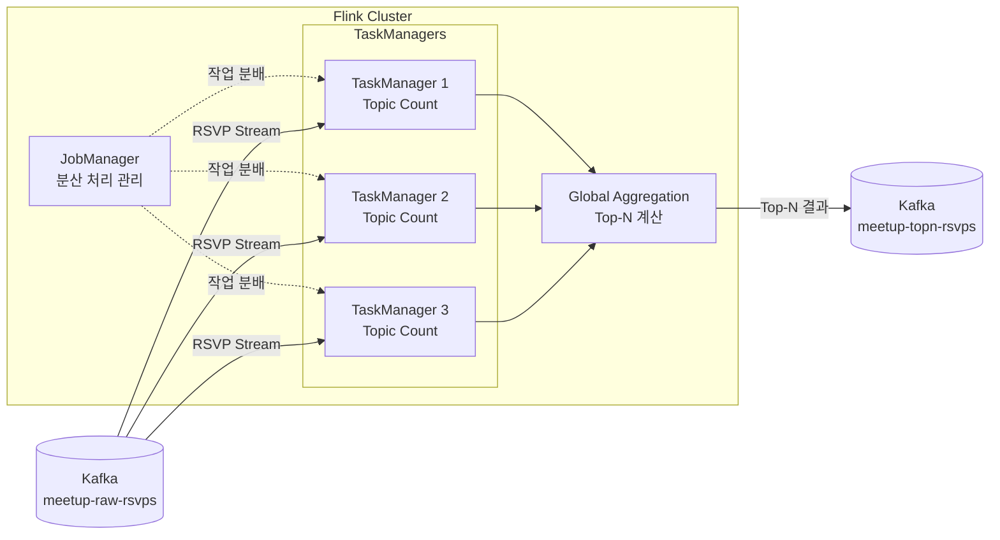
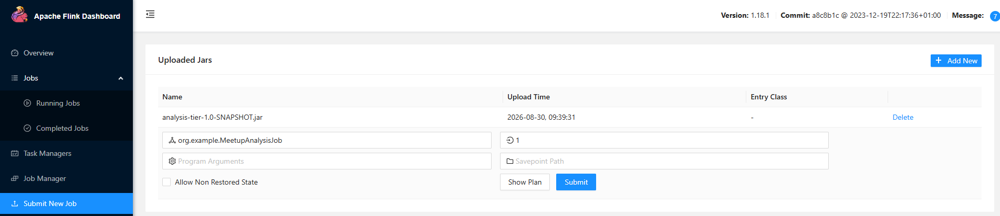

# analysis-tier

## 개요

애플리케이션을 작성하기에 앞서 Flink Job을 실행할 **Flink 클러스터**를 구성해야 한다. Flink 클러스터는 크게 **JobManager**와 **TaskManager**로 구성되며, JobManager가 작업의 전체 실행을 관리하고 TaskManager가 실제 데이터 처리를 담당하는 구조이다.

* **JobManager** : Flink 클러스터의 작업 실행을 관리하는 컴포넌트이다. 클라이언트로부터 제출된 Job을 받아 실행 계획을 생성하고, 이를 여러 Task로 분할하여 TaskManager에 배포한다. 또한 TaskManager의 상태를 모니터링하고 장애가 발생한 Task를 재실행하는 등 Job의 실행과 장애 복구를 관리한다.

* **TaskManager** : JobManager가 할당한 Task를 실제로 실행하는 컴포넌트이다. TaskManager 내부의 Task Slot에서 Source를 통해 데이터를 읽고, 필터링·변환·집계 등의 스트림 처리 연산을 수행한다. 또한 다른 TaskManager와 데이터를 주고받으며 분산 처리를 수행한다. 하나의 TaskManager만 사용하는 것이 아니라 여러 TaskManager를 구성함으로써 작업을 여러 노드에 분산하여 처리할 수 있다.

이 분석 처리 애플리케이션은 이미 구성된 Flink 클러스터에 우리가 작성한 데이터 취합, 분석, 집계 등의 처리 로직을 **Flink Job으로 제출하여 분산 처리 환경에서 실행되도록 하는 역할**을 수행한다.

### 작업 제출
우선 IDE에서 Job을 실행하는 경우에도 Flink의 미니 클러스터 환경에서 실행되기 때문에 일반적인 애플리케이션처럼 디버깅하기 어렵다는 것을 확인하였다.  

코드를 작성한 후 Flink 클러스터에 Job을 제출하기 위해서는 필요한 의존성을 포함한 JAR 파일을 생성해야 한다. 일반적인 `build` 태스크만으로 빌드하면 애플리케이션의 클래스만 포함된 JAR이 생성되고, Flink Job 실행에 필요한 외부 의존성은 포함되지 않기 때문이다.  

따라서 `build.gradle`에 `com.github.johnrengelman.shadow` 플러그인을 추가하여 의존성을 포함한 Fat JAR를 생성하도록 구성하였다. 이후 `shadowJar` 태스크를 실행하여 필요한 의존성이 포함된 JAR 파일을 생성한다.  

생성된 JAR 파일은 아래와 같이 Flink UI를 통해 업로드하고 Job을 제출할 수 있다. 제출된 Job은 Docker로 구축한 Flink 클러스터의 TaskManager에서 실행된다.  

