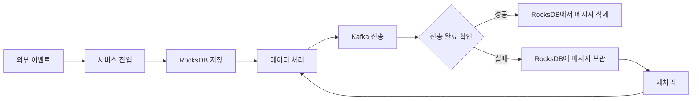

# collection-service

## 개요

수집 단계에서 사용되는 수집 서버로, Meetup 스트리밍 RSVP API에서 발생하는 이벤트 데이터를 웹소켓 방식으로 수신하여 메시지 큐에 저장하는 역할을 수행한다.  

이 서비스는 Netty 기반의 웹 서버로 구현하여 웹소켓 프로토콜을 고성능으로 처리하며, 수신한 데이터는 Kafka로 전달하는 Producer 역할을 수행한다.  

### HML(Hybrid Message Logger)

여기서 주목할 부분은 HML(Hybrid Message Logger)의 구현​이다. HML은 RBML(Receiver-Based Message Logger)과 SBML(Sender-Based Message Logger)의 개념을 결합한 내결함성 메시지 처리 기술로, 메시지 유실을 방지하고 정확히 한 번(Exactly-Once) 처리​를 달성하기 위해 직접 구현하였다.  

HML의 핵심은 서비스로 유입된 메시지를 처리 완료 및 전송이 확인될 때까지 로컬 저장소에 보관하는 것이다. 메시지가 서비스에 진입하면 먼저 RocksDB에 저장한 후 데이터를 처리하고 Kafka로 전송한다. 이후 Kafka로부터 전송 완료에 대한 확인 응답을 받으면 로컬 저장소에서 해당 메시지를 삭제한다.  
메시지 처리 과정에서 장애가 발생하더라도 아직 RocksDB에 메시지가 보관되어 있기 때문에 해당 메시지를 다시 조회하여 재처리할 수 있다. 이를 통해 애플리케이션 장애나 Kafka 전송 실패 상황에서도 메시지 유실을 방지할 수 있다.  

**HML은 결제 데이터, 광고 클릭 정산 데이터와 같이 유실이 허용되지 않는 이벤트​에 적용하기 적합**하다. 반면 모니터링 지표나 로그 데이터처럼 일부 데이터의 유실을 허용할 수 있는 경우에는 RocksDB에 메시지를 기록하고 삭제하는 추가적인 I/O 비용이 발생하므로, 성능을 고려하여 HML을 적용하지 않는 것이 더 적합하다.  